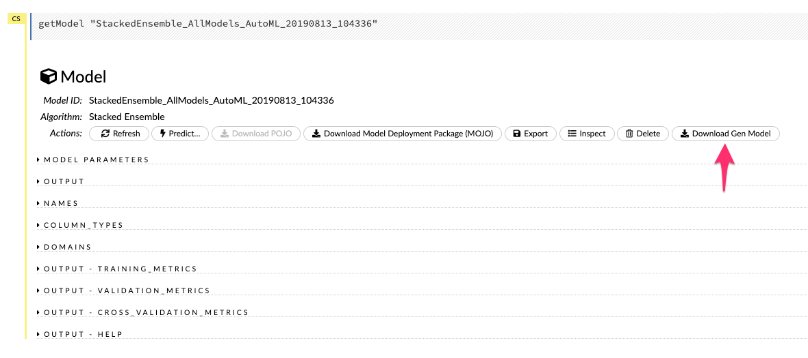
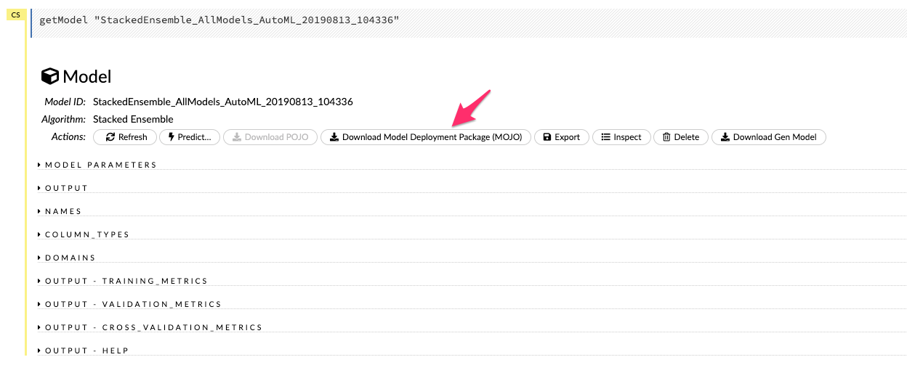
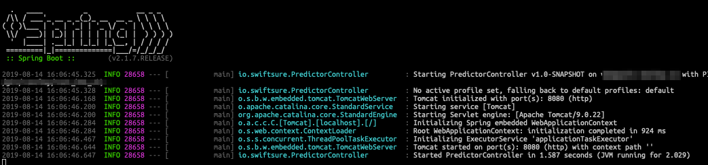

# H2O AI Restful Wrapper

The purpose of this project is to provide a re-usable Restful wrappper for the H2O AI generated models.

## Setup

This library requires three dependencies that will come out of your model generation:

1. Working Maven Installation
2. The h2o-genmodel.jar
3. The model deployment package (MOJO).

### Loading h2o-genmodel.jar

Download the file from H2O AI.

Copy the file into `$PROJECT_HOME/lib/`

### Download the Model Deployment Package (MOJO)

Download the file from H2O AI.

## Build

Once the h2o-genmodel.jar is in place you can execute the build.

    maven clean package -Dmodel-name=ransley-test-model
    
where `ransley-test-model` is some meaningful description of your model.
    
This will produce a JAR file in the target directory - `target/ransley-test-model.jar`.

## Execution

This is a two step process that starts the application:

    java -jar target/ransley-test-model.jar -model.path=mojo.zip
    
__NOTE__: The jar file itself can be copied around and does not have to live in the target directory.  Additionally, `mojo.zip` is the zip file downloaded above in the Model Deployment Package (MOJO) download step.

Execution of this will look as follows:

Once this is running you can post to http://localhost:8080.  The payload is expected to be JSON with name value pairs and each value is assumed to be a Double.  Additionally, at the moment this only supports regressions, but I might extend this in the future.

An example of a curl (obviously the input features will be dependent on your model) is as follows:

    curl -0 -v -X POST http://localhost:8080/regression \
    -H "Accept: application/json" -H "Content-type: application/json" \
    -X POST -d @- << EOF
    '{
    "past_pct_eurchf_close": -8.007584194686945, 
    "past_pct_eurgbp_close": -20.86890533105512, 
    "past_pct_eurjpy_close": 17.419864785013228, 
    "past_pct_eurusd_close": -16.47598097 , 
    "past_pct_usdcad_close": -27.46739146, 
    "past_pct_usdchf_close": 8.899911001, 
    "past_pct_usdjpy_close": 34.01672489, 
    "past_pct_usdaud_close": -71.72595738, 
    "past_pct_usdgbp_close": -4.820978727, 
    "past_pct_usdnzd_close": -54.51713396
    }'
    EOF
    
The result (assuming it isn't an error) will be a JSON response with the prediction together with the inputs:

    {
        input": {
            "past_pct_usdjpy_close":34.01672489,
            "past_pct_usdaud_close":-71.72595738,
            "past_pct_eurjpy_close":17.419864785013228,
            "past_pct_eurchf_close":-8.007584194686945,
            "past_pct_usdcad_close":-27.46739146,
            "past_pct_usdgbp_close":-4.820978727,
            "past_pct_eurgbp_close":-20.86890533105512,
            "past_pct_eurusd_close":-16.47598097,
            "past_pct_usdnzd_close":-54.51713396,
            "past_pct_usdchf_close":8.899911001
        },
        "prediction":1.2538692149339385
    }
    